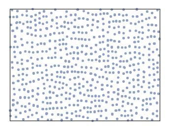

## Steps:
## 1. Mitchell algorithm


    1. choose starting circles, 
    2. generate new points, that are candidates for the next circle,
    3. select the one that is the furthest away from any other point (with largest minimum 
    distance from the other points) 
    4. repeat step 2, 
    5. ~~profit~~ number of candidates on every step should be proportionate to number
    of current circles --> multiply by number "m" (# points*m + 1)

Example for 1024 points:

<div style="text-align: center;">



</div>

___

## 2. PBC
``` python
dx = point1 - point2
if dx > 0.5*width:    dx = dx - width
if dx < -0.5*width:   dx = dx + width
```

## 3. Elliptic contact function
Two ellipses: \
$E_a = (\vec{r} - \vec{r}_1) \cdot A^{-1} \cdot (\vec{r} - \vec{r}_1)$
and \
$E_b = (\vec{r} - \vec{r}_2) \cdot B^{-1} \cdot (\vec{r} - \vec{r}_2).$

Matrices A and B: \
$ A=\sum_{i=1,2,3} a_i^{2} \hat{\vec{u}}_i \otimes\hat{\vec{u}}_i$ and
$ B=\sum_{i=1,2,3} b_i^{2} \hat{\vec{v}}_i \otimes\hat{\vec{v}}_i$, where 
$\hat{\vec{u}}_i$ are orthonormalised vectors along the three (or 2) main
axis of an ellipsoid A with lengths $a_i$, $\hat{\vec{v}}_i$ are orthonormalised
vectors along the main axes of B with lengths $b_i$. \
Define function $F(\vec{r}, \lambda)$, which is a combination of quadratic
forms $E_1(\vec{r})$ ter $E_2(\vec{r})$: \
$F(\vec{r}, \lambda) = \lambda E_a(\vec{r}) + (1-\lambda) E_b(\vec{r})$

Parameter $\lambda$ is bound to the interval $0 < \lambda < 1$, so that
$F(\vec{r}, \lambda) \geq 0$. On the interval $\lambda \in [0, 1]$ function
$F(\vec{r}, \lambda)$ has a global minimum along the curve  $\vec{r(\lambda)}$. 
Boundary conditions (where $F=0$) are $\vec{r}(0) = \vec{r_a}$ and $\vec{r}(1) = 
\vec{r_b)$. Values of $F$ on the interval are defined with an equation: 
$\nabla F(\vec{r}, \lambda) = 0$, explicitly:\
$\lambda A^{-1} (\vec{r} - \vec{r}_a) + (1-\lambda) B^{-1} (\vec{r} - \vec{r}_b) = 0 $.

Solutionn $\vec{r}(\lambda)$ can be written with a matrix $C(\lambda)=[\lambda B + 
(1-\lambda)A]^{-1}$
(inverse exists as matrices A and B are positive definite).

## 4. Increasing ellipses and rotation
