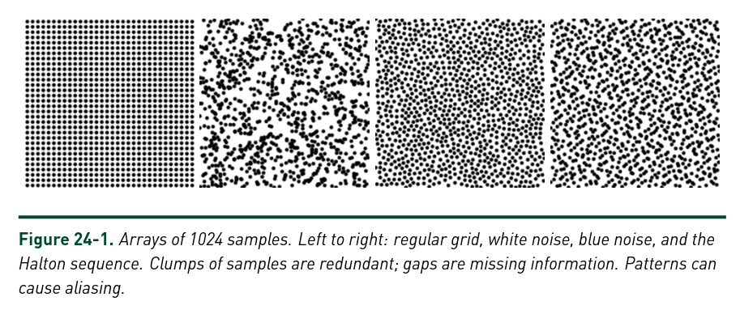
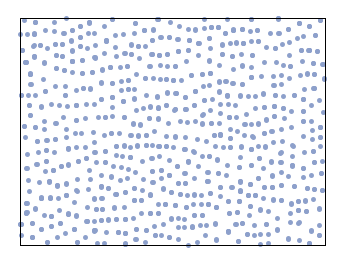

### Random notes:

Orientacijski jamming 2D elips v ravnini. 

Na začetku se postavi ("točkaste") elipse na ustrezno mrezo točk 
v 2D ravnini (s periodičnimi robnimi pogoji). Nato se z Monte Carlom 
elipse postopoma povečuje ter orientacijsko (rotacijsko) relaksira; 
njihovi položaji so torej fiksni, orientacije pa ne. Povečuje se jih, 
dokler (nekje) ne pride do jamminga, se pravi, da se elipse zagozdijo 
in se ne morejo vec rotirati. Pri tem se spremlja npr. dvodelčno 
orientacijsko parsko korelacijsko funkcijo in ustvarjanje domen in 
kolektivnih gibanj.

Koraki bi bili okvirno naslednji:

1. Generiranje 2D mrež N točk z Mitchellovim algoritmom pri različnih
številih poskusov K (mreže z različnimi stopnjami hiperuniformnosti).
(Ena implementacija je opisana npr. tu: 
[mitchell](https://observablehq.com/@mbostock/best-candidate-circles)

2. Postavitev (“točkastih”) N elips z razmerjem E v točke z naključnimi
začetnimi orientacijami. Reprezentacija elips. Periodični robni pogoji.

3. Zaznavanje trkov med elipsami. Implementacija Wertheim-Perramove
kontaktne funkcije (priloženi članek (`perram1985.pdf`) + npr.
[kontaktne funkcije](https://sbrisard.github.io/pw85/)).

4. Monte Carlo: postopno večanje/napihovanje elips, relaksacija
orientacij (naključne oz. obtežene rotacije).

5. Analiza konfiguracij: orientacijske parske korelacijske funkcije,
domene, ...

Za začetek lahko implementiraš točko 1, kar ne bi smel biti problem.
Naslednja koraka sta reprezentacija elips in implementacija kontaktne
funkcije (točki 2 in 3). Potem se pa vidi, kako najbolje zastaviti MC
shemo in analizirati konfiguracije.

___

## 1. Mitchellov algoritem

    1. izbereš točke začetnih krogov, 
    2. nove toćke, ki so kandidati za naslednjo točko, 
    3. izbereš tistega, ki je najdlje od vseh drugih točk (ima največjo minimalno
    oddaljenost do ostalih točk)
    4. ponoviš korak 2
    5. število kandidatov na vsakem koraku se mora povečat sorazmerno s številom
    že obstoječih točk --> množiš s konstanto "m" (št. točk*m + 1)

Končna porazdelitev za 1024 točk:

___

## 2. Eliptična kontaktna funkcija
Imamo dve elipsi: \
$E_a = (\vec{r} - \vec{r}_1) \cdot A^{-1} \cdot (\vec{r} - \vec{r}_1)$
in \
$E_b = (\vec{r} - \vec{r}_2) \cdot B^{-1} \cdot (\vec{r} - \vec{r}_2).$

Matriki A in B lahko zapišemo kot: \
$ A=\sum_{i=1,2,3} a_i^{2} \hat{\vec{u}}_i \otimes\hat{\vec{u}}_i$ ter
$ B=\sum_{i=1,2,3} b_i^{2} \hat{\vec{v}}_i \otimes\hat{\vec{v}}_i$, kjer so 
$\hat{\vec{u}}_i$ ortonormirani vektorji vzdolž treh polosi elipsoide A 
z dolžinami $a_i$, $\hat{\vec{v}}_i$ pa ortonormirani vektorji vzdolž polosi 
elipsoide B z dolžinami $b_i$. \
Definiramo afino funkcijo $F(\vec{r}, \lambda)$. ki je kombinacija kvadratičnih
form $E_1(\vec{r})$ ter $E_2(\vec{r})$: \
$F(\vec{r}, \lambda) = \lambda E_a(\vec{r}) + (1-\lambda) E_b(\vec{r})$

Parameter $\lambda$ je omejen na interval $0 < \lambda < 1$, tako, da imamo
$F(\vec{r}, \lambda) \geq 0$. Na intervalu $\lambda \in [0, 1]$ ima funkcija 
$F(\vec{r}, \lambda)$ globalni minimum na krivulji $\vec{r(\lambda)}$. Robni
vrednosti (kjer je $F=0$) sta $\vec{r}(0) = \vec{r_a}$ in $\vec{r}(1) = \vec{r_b}$.
Vrednosti $F$ na celem intervalu so definirane z enačbo
$\nabla F(\vec{r}, \lambda) = 0$, ali eksplicitno:\
$\lambda A^{-1} (\vec{r} - \vec{r}_a) + (1-\lambda) B^{-1} (\vec{r} - \vec{r}_b) = 0 $.

Rešitev $\vec{r}(\lambda)$ izrazimo z matriko $C(\lambda)=[\lambda B + (1-\lambda)A]^{-1}$
(inverz obstaja saj sta matriki A ter B pozitivno definitni)